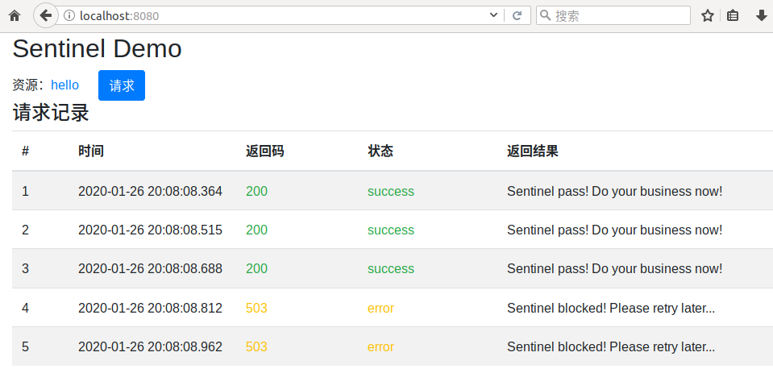

Sentinel PHP Client
===

## 快速体验

如果您是第一次接触 Sentinel，可通过 sentinel-php-demo 快速体验 Sentinel 流量防护能力。
Linux 下可使用 docker 启动 demo ，启动命令如下 (选项 `--net=host` 表示容器使用宿主机网络)：

```sh
docker run --name=demo --net=host -d registry.cn-hangzhou.aliyuncs.com/ahas/sentinel-php-demo
```

>使用结束后，使用如下命令删除 demo 容器：
>
>```sh
>docker rm demo -f
>```

demo 容器内包含：

* php + nginx 环境，nginx 默认监听 8080 端口。
* sentinel sidecar 进程，默认监听 9090 端口。
* php demo 测试代码。

demo 启动后，可通过 http://localhost:8080/ 访问 demo 测试页面。
demo 中默认定义了一个名为 `hello` 的资源，保护该资源每秒钟最多只允许被访问 3 次。
页面 `/hello.php` 使用了该资源，每秒请求压力超过 3 次时，超过压力限制的请求将提示稍后再重试。
demo 主页是一个简单的测试页面，快速连续点击 **请求** 按钮对 `/hello.php` 页面发起请求，可看到类似如下的测试结果。



## 在 PHP 中使用 Sentinel

准备在您的 PHP 项目中试用 Sentinel，棒！
首先需要梳理需要保护的资源，如数据库请求或后端 RPC 调用等，取一个简单清晰的资源名字，配置流控规则。
如何配置流控规则，我们稍后再说，这里先以 demo 中的 `hello` 资源为例，接下来，show me the code 。

### 添加 Sentinel 依赖

PHP 项目通常使用 composer 管理依赖，可配置使用阿里云镜像加速下载依赖，命令如下：

```sh
composer config -g repositories.packagist composer https://mirrors.aliyun.com/composer/
```

添加 sentinel 依赖，命令如下：

```sh
composer require ahas/sentinel dev-master --prefer-dist
```

>sentinel php 客户端暂未发布正式版本，暂安装 `dev-master` 开发版本，
>使用 `--prefer-dist` 选项安装发行版本，以便从镜像站点加速下载。

通常在 PHP 源码文件头部引入 composer autoload 文件，以支持自动加载 PHP 类。类似如下代码：

```php
require_once __DIR__ . "/vendor/autoload.php";
```

### 创建 Sentinel 客户端

创建一个 Sentinel 客户端对象，作为调用 Sentinel 方法的入口，供全局共享使用。
Sentinel 客户端采用“轻”客户端模式，客户端使用简单 RPC 与本地 sidecar 进程通信，
创建 Sentinel 客户端时需要指定 sidecar 地址。代码如下：

```php
// 创建 Sentinel 客户端
$sentinel = new \Sentinel\SentinelClient("localhost", 9090);
```

### 添加保护代码

找到访问受保护资源的代码块。设 `index.php` 文件包含如下代码：

```php
// 受保护的业务逻辑, sleep 200ms 模拟业务耗时。
echo "Killer Business!";
usleep(200 * 1000);
```

将受保护的业务逻辑放到 try 语句中。如下所示：

```php
try {
	// 受保护的业务逻辑, sleep 200ms 模拟业务耗时。
	echo "Killer Business!";
	usleep(200 * 1000);
} finally {
}
```

受保护的资源在 Sentinel 中用资源名 (如 "hello") 抽象表示，
必须在执行受保护的代码前，即 try 语句开头，调用 `entry()` 方法获取资源访问入口。
该方法返回一个抽象表示该资源正在被一个用户访问的 SentinelEntry 对象。
如限制一个资源最多被 10 个用户同时访问，10 个用户同时访问时即存在 10 个 SentinelEntry 对象，此时第 11 个用户请求将被拒绝。
执行受保护的代码时，必须使用一个变量保存返回的对象，否则返回的 SentinelEntry 对象被自动销毁，将自动释放资源。
相反，受保护的代码执行完毕 (释放资源) 后，必须将对应的变量置为 null ，以销毁 SentinelEntry 对象并通知 Sentinel 允许接受新的用户请求。
务必把对应变量置为 null 的语句写到 finally 子句中，以确保该逻辑被执行。
修改后的代码示例如下：

```php
try {
	// 获取受保护的资源入口。
	// 注意: 必须定义一个变量保存访问入口, 否则返回对象被自动销毁, 将自动释放访问入口。
	$sentinelHelloEntry = $sentinel->entry("hello");

	// 受保护的业务逻辑, sleep 200ms 模拟业务耗时。
	echo "Killer Business!";
	usleep(200 * 1000);
} finally {
    // 将保存 SentinelEntry 对象的变量置为 null, 使不再有变量引用 SentinelEntry 对象, 以销毁对象并释放资源。
    $sentinelHelloEntry = null;
}
```

### 添加限流降级逻辑

## 接入 AHAS

## 配置限流规则
