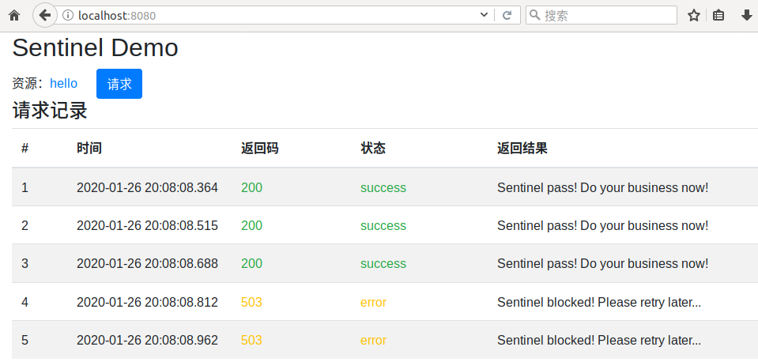
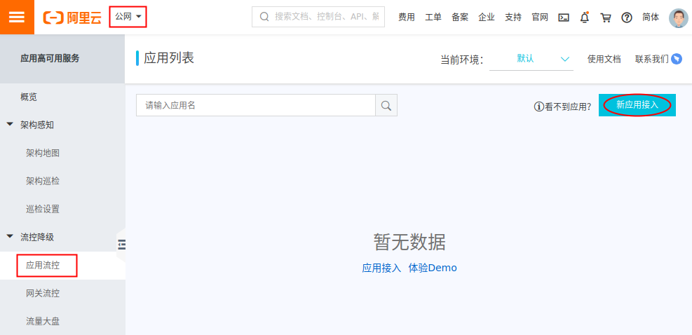
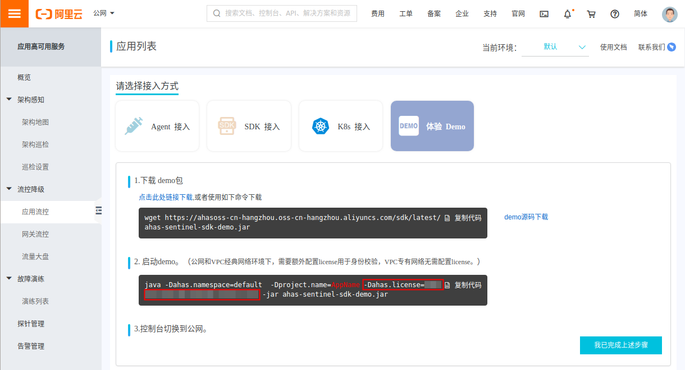
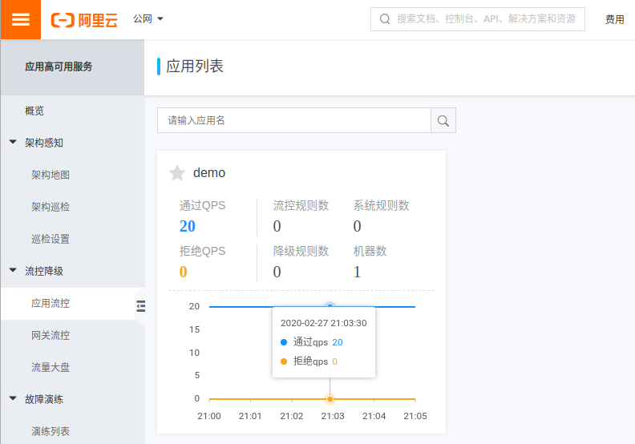
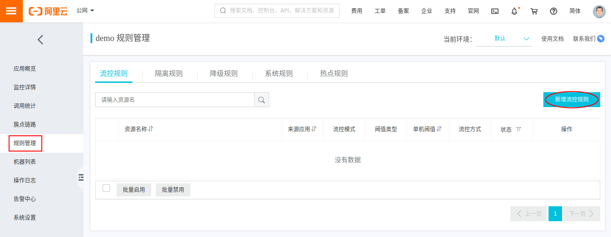
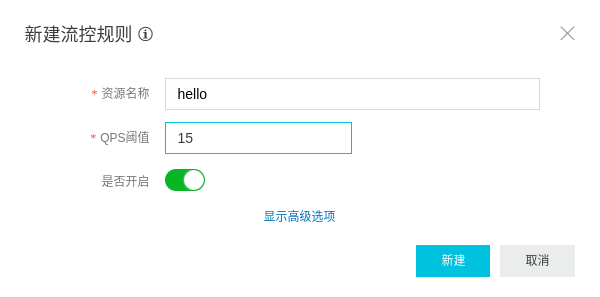
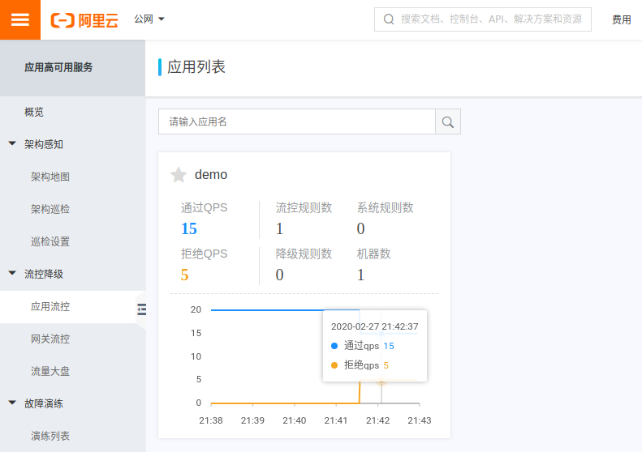

Sentinel PHP Client
===

## 快速体验

如果您是第一次接触 Sentinel，可通过 sentinel-php-demo 快速体验 Sentinel 流量防护能力。
Linux 下可使用 docker 启动 demo ，启动命令如下 (选项 `--net=host` 表示容器使用宿主机网络)：

```sh
docker run --name=demo --net=host -d registry.cn-hangzhou.aliyuncs.com/ahas/sentinel-php-demo
```

>使用结束后，使用如下命令删除 demo 容器：
>
>```sh
>docker rm demo -f
>```

demo 容器内包含：

* php + nginx 环境，nginx 默认监听 8080 端口。
* sentinel sidecar 进程，默认监听 9090 端口。
* php demo 测试代码。

demo 启动后，可通过 http://localhost:8080/ 访问 demo 测试页面。
demo 中默认定义了一个名为 `hello` 的资源，保护该资源每秒钟最多只允许被访问 3 次。
页面 `/hello.php` 使用了该资源，每秒请求压力超过 3 次时，将提示超过压力的请求稍后再试。
demo 主页是一个简单的测试页面，快速连续点击 **请求** 按钮向 `/hello.php` 页面发起请求，可看到类似如下的输出结果。



## 在 PHP 中使用 Sentinel

准备在您的 PHP 项目中试用 Sentinel，棒！
首先梳理需要保护的资源，如数据库访问或后端 RPC 接口等，为资源取一个简单清晰的名字。
这里以 demo 中的 `hello` 资源为例。接下来，show me the code 。

### 添加 Sentinel 依赖

PHP 项目通常使用 composer 管理依赖，可配置使用阿里云镜像加速下载依赖，命令如下：

```sh
composer config -g repositories.packagist composer https://mirrors.aliyun.com/composer/
```

添加 sentinel 依赖，命令如下：

```sh
composer require ahas/sentinel dev-master --prefer-dist
```

>sentinel php 客户端暂未发布正式版本，暂安装 `dev-master` 开发版本，
>使用 `--prefer-dist` 选项安装打包分发版本，以便从镜像站点加速下载。

通常在 PHP 源码文件头部引入 composer autoload 文件，以支持自动加载 PHP 类。类似如下代码：

```php
require_once __DIR__ . "/vendor/autoload.php";
```

### 创建 Sentinel 客户端

Sentinel 客户端是调用 Sentinel 方法的入口，
只需要创建一个 Sentinel 客户端对象，供全局共享使用。
Sentinel 客户端使用简单 RPC 与本地 sidecar 进程通信，
创建 Sentinel 客户端时需要指定 sidecar 地址。
demo 启动 sidecar 默认地址为 localhost 9090 端口，创建 Sentinel 客户端示例代码如下：

```php
// 创建 Sentinel 客户端
$sentinel = new \Sentinel\SentinelClient("localhost", 9090);
```

### 添加保护代码

找到访问受保护资源的代码块。如 `index.php` 文件包含如下代码：

```php
// 受保护的业务逻辑, sleep 200ms 模拟业务耗时。
echo "Killer Business!\n";
usleep(200 * 1000);
```

将受保护的业务逻辑放到 try 语句中。如下所示：

```php
try {
	// 受保护的业务逻辑, sleep 200ms 模拟业务耗时。
	echo "Killer Business!\n";
	usleep(200 * 1000);
} finally {
}
```

为受保护的资源取一个名字，命名尽量简单清晰，这里使用 `hello` 为例。
执行受保护的代码前，即 try 语句开头，添加调用 `entry()` 方法获取资源访问入口。
该方法返回一个抽象表示资源正在被用户锁定访问的 SentinelEntry 对象 (简称入口对象) 。
如配置一个资源最多被 10 个用户同时访问，10 个用户同时访问时即存在 10 个入口对象锁定资源，此时第 11 个用户请求将被拒绝。

```php
// 获取受保护的资源访问入口。
$sentinelHelloEntry = $sentinel->entry("hello");
```

**注意：** 获取资源访问入口后，必须定义一个变量保存入口对象 (如示例中的 `$sentinelHelloEntry` 变量) ，否则入口对象将被自动销毁并释放资源。
相反，受保护的代码执行完毕后，必须将对应的变量置为 null ，使不再有变量引用入口对象，
以销毁入口对象并通知 Sentinel 释放资源、允许接受新的请求。
请务必在 finally 子句中将保存入口对象的变量置为 null，以确保该逻辑被执行。
修改后的代码示例如下：

```php
try {
	// 获取受保护的资源访问入口。
	// 注意: 必须定义一个变量保存入口对象, 否则入口对象将被自动销毁并释放资源。
	$sentinelHelloEntry = $sentinel->entry("hello");

	// 受保护的业务逻辑, sleep 200ms 模拟业务耗时。
	echo "Killer Business!\n";
	usleep(200 * 1000);
} finally {
    // 将保存入口对象的变量置为 null, 使不再有变量引用入口对象, 以销毁入口对象并释放资源。
    $sentinelHelloEntry = null;
}
```

>PHP 中 try 子句与 finally 子句作用域相同。
>即使在 try 子句中获取入口对象失败，在 finally 子句中将变量置为 null 也不会有副作用。

### 添加限流处理

请求压力超过限制时， `entry()` 方法抛出 `BlockException` 异常，阻止继续执行受保护的代码块，避免压垮后端系统。
此时可在 try 语句添加捕获此异常的 catch 子句，添加限流处理逻辑，如提示用户稍后再试等，让用户快速得到反馈提示。
这样即保护了后端系统 (挡住流量洪峰)，又可以改善前端用户的体验。

修改之后的 `index.php` 文件完整代码示例如下：

```php
<?php
require_once __DIR__ . "/vendor/autoload.php";

// 创建 Sentinel 客户端
$sentinel = new \Sentinel\SentinelClient("localhost", 9090);

try {
	// 获取受保护的资源访问入口。
	// 注意: 必须定义一个变量保存入口对象, 否则入口对象将被自动销毁并释放资源。
	$sentinelHelloEntry = $sentinel->entry("hello");

	// 受保护的业务逻辑, sleep 200ms 模拟业务耗时。
	echo "Killer Business!\n";
	usleep(200 * 1000);
} catch (\Sentinel\BlockException $e) {
	// 请求压力超过限制, 提示用户稍后再试。
	echo "Online user FULL! Try later...\n";
} finally {
    // 将保存入口对象的变量置为 null, 使不再有变量引用入口对象, 以销毁入口对象并释放资源。
    $sentinelHelloEntry = null;
}
```

### 命令行测试 PHP 代码

代码开发完成！
可直接使用 php 命令行测试运行 php 文件，这非常方便开发测试 php 代码。
如测试上述示例代码，可看到输出结果如下：

```text
$ php index.php 
Killer Business!
```

如果出现如下报错：

```text
$ php index.php 
PHP Fatal error:  Uncaught Thrift\Exception\TException: TSocket: Could not connect to localhost:9090 (Connection refused [111])
```

这是因为连接 Sentinel sidecar 失败，请确认启动 sidecar 进程。可启动 demo 以使用 demo 中的 sidecar 进行测试。

连续多次执行脚本，测试超出压力限制时的场景，可看到类似如下输出：

```text
$ for e in $(seq 5) ; do php index.php ; done
Killer Business!
Killer Business!
Killer Business!
Online user FULL! Try later...
Online user FULL! Try later...
```

### 部署测试 PHP 代码

命令行测试通过后，即可尝试在您的 PHP 环境中部署项目代码，并进行测试。
请确保必须在部署执行 php 项目代码的机器上启动 Sentinel sidecar 。

如果您不方便部署 php 代码，同时又希望快速在浏览器中进行测试，
还可以尝试使用 demo 镜像快速测试 php 项目代码。
假设您的 php 项目代码路径为 `${MY_PHP_APP}` ，
通过如下命令启动 demo 容器，即可使用您的 php 项目代码覆盖 demo 镜像中自带的测试代码。

```sh
docker run --name=demo --net=host -v "${MY_PHP_APP}:/app/php" -d registry.cn-hangzhou.aliyuncs.com/ahas/sentinel-php-demo
```

demo 容器启动后，通过浏览器访问 http://localhost:8080/ 页面，即可看到你的 php 项目在浏览器中的运行结果。

现在我们只是在本地环境进行了简单测试。
接入 AHAS Sentinel 控制台，可以进一步体验 Sentinel 简单、直观、强大的流量防护能力。

## 接入 AHAS Sentinel 控制台

AHAS Sentinel 控制台是阿里云提供的企业级 Sentinel 控制台云服务。

在阿里云专有网络 VPC 下部署应用时， Sentinel 客户端可自动接入 AHAS Sentinel 控制台。
在本机测试运行 demo 时，通过公网接入 Sentinel 控制台，需要额外配置 license 用于身份校验。

### 查询公网接入 license

登录阿里云 [AHAS (应用高可用服务) 控制台](https://ahas.console.aliyun.com/) 页面，
如果尚未开通 AHAS 服务，可免费开通。

点击控制台左上角的地域列表，选择地域为 **公网** ，左侧导航栏选择 **流控降级 > 应用流控** 。
当前未接入应用，可看到应用列表为空。点击右上角 **新应用接入** 按钮查看接入方式。



这里主要是为了查询公网接入需要的 license 参数，接入方式选择 **体验 Demo** ，即可看到 license 参数。
我们使用 sentinel-php-demo 镜像，无需下载 Java demo 。
复制记录下 license 参数， **license 是用户机密信息，请注意保密不要泄露** 。



### 启动 demo 应用

为应用取一个简单清晰的应用名，这里我们使用 demo 。
使用如下命令启动 demo 容器，注意将 `${license}` 替换为您实际的 license 参数值。

```sh
docker run --name=demo --net=host -d registry.cn-hangzhou.aliyuncs.com/ahas/sentinel-php-demo -Dahas.namespace=default -Dproject.name=demo -Dahas.license=${license}
```

>同样，您也可以在宿主机上部署您的 PHP 项目代码连接 demo 容器中的 sidecar ，
>或在启动 demo 容器时添加 `-v "${MY_PHP_APP}:/app/php"` 选项使用您的 PHP 项目代码覆盖镜像中自带的 demo 测试代码。

向 demo 页面 `/hello.php` 发起请求，触发对资源 hello 的访问流量。
demo 镜像内有一个小工具 http_load ，可直接在 demo 容器中使用此工具发起测试，
如测试每秒钟发起 20 个请求，操作命令如下：

```sh
docker exec -it demo bash -c "echo http://localhost:8080/hello.php > /tmp/url.txt && http_load -rate 5 -seconds 300 /tmp/url.txt"
```

应用接入页面点击 **我已完成上述步骤** ，回到应用列表页面。
稍等即可看到刚刚接入的 demo 应用，同时直观清晰的展示了应用访问资源的 QPS 曲线图。
接入 Sentinel 控制台后，限流规则在控制台上配置，当前尚未配置限流规则，
因此可看到当前通过 QPS 稳定为 20 ，拒绝 QPS 为 0 。



### 配置限流规则

点击应用卡片进入应用详情页，左侧菜单选择 **规则管理** ，右侧页面点击 **新增流控规则按钮** 。



**资源名称** 填写在代码中使用的资源名称，如这里 demo 中使用 hello ，**QPS阈值** 尝试填写为 15 进行测试。
点击 **新建** 按钮完成配置。



回到应用列表页，很快将看到通过 QPS 被限制为 15 ，即上述配置的 QPS 阈值，
同时拒绝 QPS 变成 5，每秒钟有 5 个超出压力限制的请求被挡掉。



点击应用卡片，查看监控详情，除了应用整体 QPS 等概览监控外，
还可以查看接口 (资源) 维度、机器维度的各种监控详情。

## 更多

Sentinel 是面向分布式服务架构的专业流量控制组件，以流量为切入点，从流量控制、熔断降级、系统负载保护等多个维度保障业务的稳定性。
AHAS Sentinel 控制台提供企业级的控制台服务，提供简单、直观的动态规则管理/推送，丰富的实时监控数据展示，告警等功能。
Sentinel PHP 客户端旨在帮助 PHP 应用快速接入使用 Sentinel ，采用“轻”客户端模式，使用 sidecar 复用成熟稳定的已有代码。

更多信息请参考 AHAS 应用流控降级相关文档： https://help.aliyun.com/document_detail/101132.html 。
